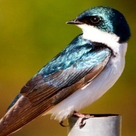
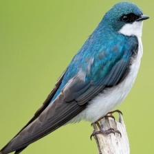
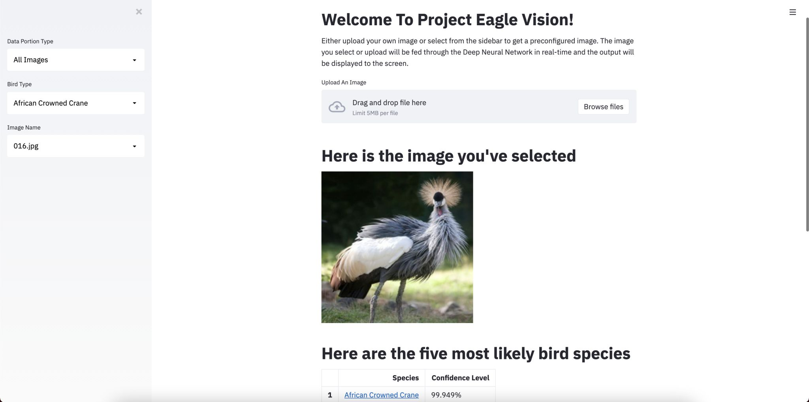

# Project Eagle Vision
Before I go over anything else, here's a link the website hosting the app:

[Eagle Vision Homepage](https://share.streamlit.io/joshmantova/eagle-vision/prod/src/Project_Eagle_Vision.py)

Technologies used: 
* Python
* Pytorch
* Streamlit
* Docker
* AWS EC2
* AWS Sagemaker
* AWS S3

# Summary
This project involved using Deep Convolutional Neural network to create a machine learining application that could classify 250 bird species based on images. The model architecture is a [ResNet50](https://en.wikipedia.org/wiki/Residual_neural_network) that was initially trained on the [ImageNet Dataset](https://en.wikipedia.org/wiki/ImageNet). Transfer learning was utilized to fine tune the ImageNet model to learn how to classify birds. After training, the model correctly identified 97% of bird images held out from training. The trained model was then deployed in an interactive website to allow users to identify their own bird pictures.

# Introduction
My girlfriend and I love to birdwatch. She is extremely talented at identifying the species of a bird based on very few cues. Although I enjoy birdwatching just as much, I tend to think that every big bird I see is either an Eagle or a Hawk. Out here in Colorado, I'm correct a surprisingly large proportion of the time but my predictions are clearly not all that sophisticated. 

I started thinking about bird identification as a supervised learning problem - there are certain visual cues that when combined, lead to a certain classification. That's when it became obvious that instead of getting better at identification myself, I could use my computer as a crutch and have it learn how to identify birds for me! With the help of a little math (okay.. a lot of math), the tables have turned; now out of myself and my girlfriend, I am the better bird classifier.

# Dataset
The dataset used for this project was found [on Kaggle](https://www.kaggle.com/gpiosenka/100-bird-species). Someone else went through the hard work of compiling and cleaning bird images so that I didn't have to. The dataset included 250 species of birds with about 100 - 130 training images of each species. Although this class imbalance did exist in the training data, it did not substantially affect the model scores. The validation and test data each included 5 images of each species. 

In any given image, the bird was near the center of the image and took up at least 50% of the image. This made it great for training but not the best for use in real world inference. Having said that, each species of bird had a variety of different positions they would be in including flying, sitting, perched on trees, etc. Additionally, image augmentation was critical to a high scoring model. Although any model trained on this data would not likely be able to correctly identify a bird from very far away, it would be likely to correctly identify a bird regardless of what position the bird was in.

# Model Architecture

A ResNet50 model was used as the model for this project. Because this model has been so successful in so many image classification competitions in the past and my best ResNet model score was good enough for me, I did not explore any other model architectures. The model weights were initially trained on the [ImageNet Dataset](https://en.wikipedia.org/wiki/ImageNet) and only the last two layers - including the new top - were fine tuned. This allowed me to train this model and iterate through hyperparameter combinations much more quickly than would have been possible otherwise. I also used my own implementation of [early stopping](https://en.wikipedia.org/wiki/Early_stopping) to prevent overfitting and decrease training time. Pytorch was my weapon of choice as a programming framework because of the ease of use and amount of model customization possible.

# Model Scores
* Training accuracy, weighted recall, weighted precision, and weighted F1 scores were all .99
    * Validation scores were all .98
    * Holdout test scores were all .98
* Among all training images, the model had the hardest time classifying the Barn Swallow
    * Recall score of .78 and F1 score of .87
    * Most frequently mistook the Barn Swallow for a Tree Swallow

Here are examples of both a Barn Swallow and a Tree Swallow. Can you identify which is which?
### Barn Swallow:

### Tree Swallow:

# Streamlit App

I created a publically hosted application using Streamlit to showcase this project and allow users to interact with the trained model with a no-code implimentation. Users can select from any of the images I used for training, validation, and testing or they can upload their own image and see how the model would classify it.

The app outputs a table of the top five predictions including confidence levels of each prediction and a link to the Wikipedia page of the bird species in case users want to learn more.

# Future direcitons
I have several ideas to improve this project:
* Add explanations for how the CNN works with multiple levels of explanation depending on user selection of dropbox
* If predicted confidence is under some threshold, say something about not being sure about the prediction
* Potentially have a stacked model where the first model predicts if the image is a bird or not - if not, do something funny to the user for trying to trick me
