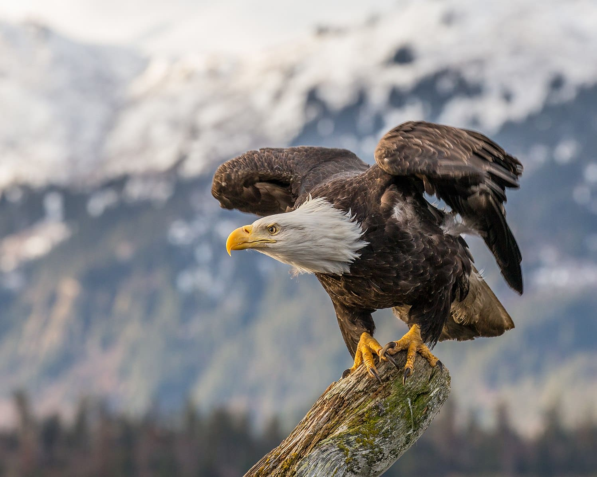

# Project Eagle Vision
Before I go over anything else, here's a link the website hosting the app:

<!-- [Eagle Vision Homepage](http://ec2-52-39-236-240.us-west-2.compute.amazonaws.com:8501/) -->
The following link will start up the webserver and start the app. You may need to refresh the page a couple of times as the instructions
will tell you. It shouldn't take more than 60 seconds to start it up.

[Eagle Vision Homepage](https://hsd329wsvd.execute-api.us-west-2.amazonaws.com/default/runEC2Instance)

The link above is actually not the link to the website - instead, it's a link to a API Endpoint that triggers a serverless AWS Lambda function
that will start up the webserver instance and run the necessary code to start the app. The endpoint times out after 30 seconds and because
starting up the instance will always take 45-60 seconds, you should expect for it to take a little bit, and then ask you to refresh the page.
After refreshing the page, it should provide you a link to the webapp that just started up. After 5 minutes of inactivity, the webserver
will shut back down. This is done to allow people to use the app whenever they'd like without making me pay for 24/7 hosting.

Technologies used: 
* Python
* Pytorch
* Streamlit
* Docker
* AWS EC2
* AWS Sagemaker
* AWS S3
* AWS Lambda
* AWS API Gateway

# Summary
This project involved using Deep Convolutional Neural network to create a machine learining application that could classify 250 bird species based on images. The model architecture is a [ResNet50](https://en.wikipedia.org/wiki/Residual_neural_network) that was initially trained on the [ImageNet Dataset](https://en.wikipedia.org/wiki/ImageNet). Transfer learning was utilized to fine tune the ImageNet model to learn how to classify birds. After training, the model correctly identified 97% of bird images held out from training. The trained model was then deployed in an interactive website to allow users to identify their own bird pictures.

# Introduction
My girlfriend and I love to birdwatch. She is extremely talented at identifying the species of a bird based on very few cues. Although I enjoy birdwatching just as much, I tend to think that every big bird I see is either an Eagle or a Hawk. Out here in Colorado, I'm correct a surprisingly large proportion of the time but my predictions are clearly not all that sophisticated. 

I started thinking about bird identification as a supervised learning problem - there are certain visual cues that when combined, lead to a certain classification. That's when it became obvious that instead of getting better at identification myself, I could use my computer as a crutch and have it learn how to identify birds for me! With the help of a little math (okay.. a lot of math), the tables have turned; now out of myself and my girlfriend, I am the better bird classifier.

# Dataset
The dataset used for this project was found [on Kaggle](https://www.kaggle.com/gpiosenka/100-bird-species). Someone else went through the hard work of compiling and cleaning bird images so that I didn't have to. The dataset included 250 species of birds with about 100 - 130 training images of each species. Although this class imbalance did exist in the training data, it did not substantially affect the model scores. The validation and test data each included 5 images of each species. 

In any given image, the bird was near the center of the image and took up at least 50% of the image. This made it great for training but not the best for use in real world inference. Having said that, each species of bird had a variety of different positions they would be in including flying, sitting, perched on trees, etc. Additionally, image augmentation was critical to a high scoring model. Although any model trained on this data would not likely be able to correctly identify a bird from very far away, it would be likely to correctly identify a bird regardless of what position the bird was in.

# Model Architecture

A ResNet50 model was used as the model for this project. Because this model has been so successful in so many image classification competitions in the past and my best ResNet model score was good enough for me, I did not explore any other model architectures. The model weights were initially trained on the [ImageNet Dataset](https://en.wikipedia.org/wiki/ImageNet) and only the last two layers - including the new top - were fine tuned. This allowed me to train this model and iterate through hyperparameter combinations much more quickly than would have been possible otherwise. I also used my own implementation of [early stopping](https://en.wikipedia.org/wiki/Early_stopping) to prevent overfitting and decrease training time. Pytorch was my weapon of choice as a programming framework because of the ease of use and amount of model customization possible.

# Model Scores
* which birds did the model struggle with?

# Streamlit App

# Future direcitons
I have several ideas to improve this project:
* Add wikipedia link to bird species in pandas dataframe for each predicted species
* Add explanations for how the CNN works with multiple levels of explanation depending on user selection of dropbox
* If predicted confidence is under some threshold, say something about not being sure about the prediction
* Potentially have a stacked model where the first model predicts if the image is a bird or not - if not, do something funny to the user for trying to trick me
